# Exploración de dirección artística · Issue #41

Entrega de Fase 1 para César/Product, 6 de octubre de 2026. **Exploración pendiente de selección**, sin aprobación de identidad ni autorización para Figma. [Issue #41](https://github.com/montunolabs/HealthGoals/issues/41) define el alcance; #30 continúa bloqueada. Ninguna imagen representa una pantalla terminada.

La entrega reúne esta exploración principal y un [suplemento independiente de Design](suplemento/README.md), integrado tras la autorización de César para coordinar y reunir los dos chats. El conjunto conserva **ocho moodboards, veinticuatro conceptos de firma y dos estudios de tres familias cromáticas**, con materiales y motion de ambas propuestas. Papel y tejido comparten territorio; impresión y mosaico amplían la divergencia. Los códigos del suplemento son locales a su dossier: «suplemento C02» no es «principal C02». Sus recomendaciones se conservan junto a las de esta exploración. La selección conjunta de Design está al final del test conceptual; César/Product mantiene la decisión. Después de esa selección se añade una [candidata adicional, 05 · Marcas](#candidata-adicional--05--marcas-tú-y-tu-ritmo), con render propio en lugar de imagen generada, incorporada a petición de César.

## Punto de partida

Se leyeron completos el [benchmark Product #38](https://github.com/montunolabs/HealthGoals/issues/38), el [benchmark independiente y entrega #39](https://github.com/montunolabs/HealthGoals/issues/39#issuecomment-6014904321), la [revisión Product de #40](https://github.com/montunolabs/HealthGoals/issues/40#issuecomment-6018471087) y las decisiones funcionales de [#32](https://github.com/montunolabs/HealthGoals/issues/32). #38, #39 y #40 están cerradas; #40 terminó sin selección. Se conserva edición inline, progreso semanal en Punto de partida, validación junto al campo, vacío limpio, transiciones de métricas y reconocimiento del progreso. No se reabren sus decisiones de comportamiento ni se resuelven silenciosamente los contratos de validación pendientes.

El descarte de #40 cambia el método: explorar objetos gráficos antes de una Home. Evitar el abanico entendido como gauge, los bloques editoriales que parecen dashboard y la escena ilustrada separada de los datos. La hipótesis nueva es **materia realizada + testigo habitual + límite de objetivo** en una misma referencia cuantitativa. La ilustración participa en esa relación; no rellena espacio.

De Gentler se toma la convivencia de dato/contexto/estado, no su Activity Path; de Flighty, una superficie que responda a una pregunta; de Waterllama, dato que transforma forma sin mascota; de Structured, referencias espaciales legibles sin agenda diaria; de Things, continuidad de acciones. CARROT y Headspace sirven para contrastar voz gráfica sin añadir personajes. Fitness, Bevel y Athlytic funcionan como controles de energía/jerarquía y de los riesgos de rings/densidad clínica. Son principios extraídos de los benchmarks, no nuevas observaciones de apps instaladas.

## Datos comunes y lectura de las imágenes

Todos los doce conceptos principales usan **Pasos: actual 24.000, habitual ahora 21.500, objetivo 40.000, restante 16.000**. Son datos ficticios creados para comparación, sin información HealthKit personal.

| Referencia | Valor | Posición normalizada en el objetivo |
| --- | ---: | ---: |
| Actual | 24.000 pasos | 60 % |
| Habitual ahora | 21.500 pasos | 53,75 % |
| Objetivo final | 40.000 pasos | 100 % |
| Restante | 16.000 pasos | 40 % |

Actual supera habitual en 2.500 pasos, 6,25 puntos de la meta. El estado del ejemplo es «por delante»: supera también la tolerancia vigente de 2.000 pasos (5 % de 40.000) en `PaceCalculator`. No se cambia el cálculo ni se propone que cualquier diferencia positiva signifique ir por delante. El testigo procede del patrón histórico por métrica en ese momento; nunca de dividir la meta por siete.

Gramática propuesta: sólido/textura = real; línea discontinua o costura = habitual ahora; contorno extremo = meta; espacio por realizar = restante. El testigo permanece visible delante del relleno, también si está por detrás del actual. Su relación geométrica complementa el estado textual existente, no lo sustituye. «Habitual» no significa mínimo, recomendación, diagnóstico ni deuda.

Son imágenes generadas: letras, proporciones, perspectiva, contornos y densidad pueden ser aproximados. **Los valores y reglas de este documento son la referencia exacta**; las imágenes permiten juzgar potencial, no auditar medidas ni accesibilidad. Los moodboards incluyen vocabulario más libre; los doce conceptos acotan su significado. No contar partículas, hilos o pliegues como muestras o pasos individuales.

## Cuatro moodboards

### 01 · Trama

**Táctil · humana · flexible · serena.** Ultramar/tangerina, carácter humanista redondeado, tejido abierto, costuras y bordes de urdimbre. Iconos simples de huella/chispa, sin personaje. La propia trama es ilustración y dato: lo tejido frente a lo que sigue abierto. Profundidad de fibra y sombras suaves; contenido opaco, controles nativos separados. Motion: un tramo se convierte en tejido ante una lectura nueva y después queda quieto. En iOS 26 el tejido permanece contenido, sin material glass propio.

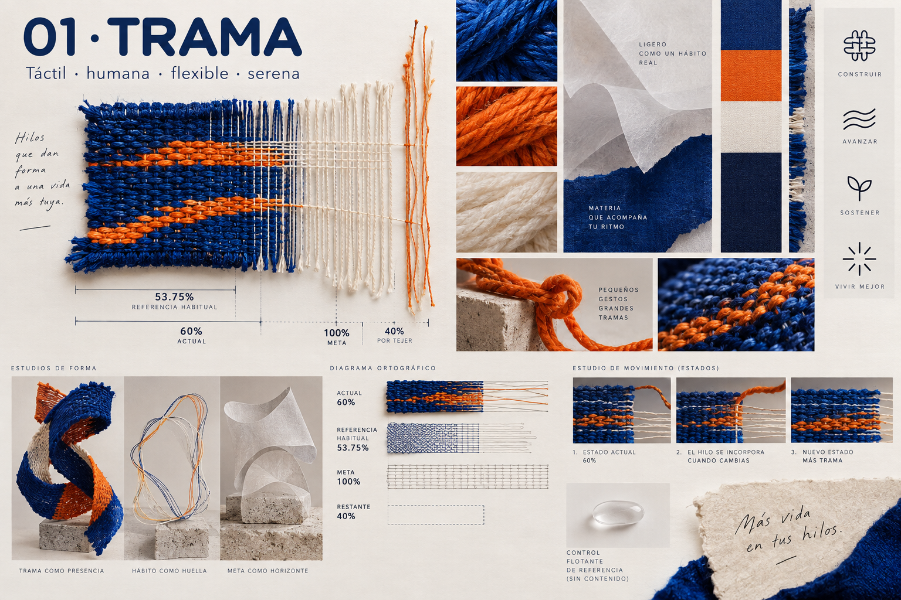

### 02 · Pliegue

**Gráfica · precisa · atrevida · adulta.** Violeta/azafrán, sans estrecha con numerales abiertos, cortes angulares y marcas de registro. Iconos monolineales. Ilustración hecha de papel que codifica dato, sin escena figurativa. Papel mate, sombras duras, profundidad de pliegues; contraste con la ligereza de controles nativos. Motion: cambia una arista o pliegue ante un dato real, sin desplegar toda la composición al entrar. Sus formas son contenido, sin imitar toolbar con origami.

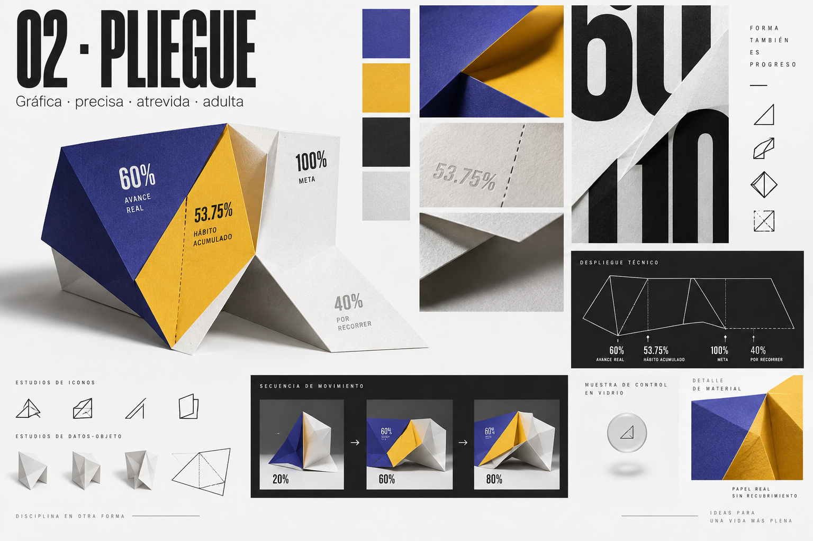

### 03 · Materia

**Espacial · cálida · escultórica · tranquila.** Cerámica violeta/cobre, tipografía humanista amplia, lóbulos asimétricos y secciones. Iconos grabados sencillos. Sin fotografía ni personaje: la sección del volumen materializa cantidades. Cerámica/clay opacos, luz lateral y oclusión suave; plano cuantitativo frontal para evitar interpretar volumen aparente como porcentaje. Motion: movimiento finito del plano de corte; nunca respiración continua. Controles glass por encima de un margen tranquilo, sin convertir cerámica en cristal.

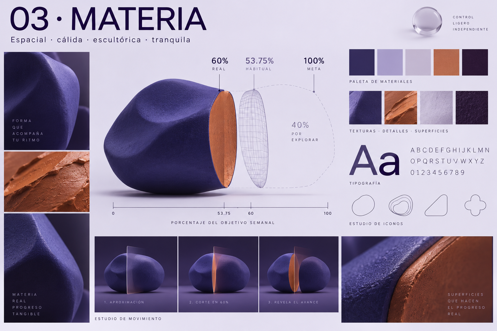

### 04 · Campo

**Vibrante · abierta · abstracta · contemporánea.** Ámbar/hielo sobre tinta, numerales mono y títulos humanistas aireados, campos irregulares de impresión. Iconos simples acompañados de puntos, sin astronomía literal. Ilustración abstracta integrada con la ocupación del campo. Profundidad de tinta/halftone, no neón ni HUD. Motion: incorporación finita al actualizar, sin partículas autónomas. Sobre iOS 26, campo opaco con separación y adaptación nativa de controles; no glass sobre glass.

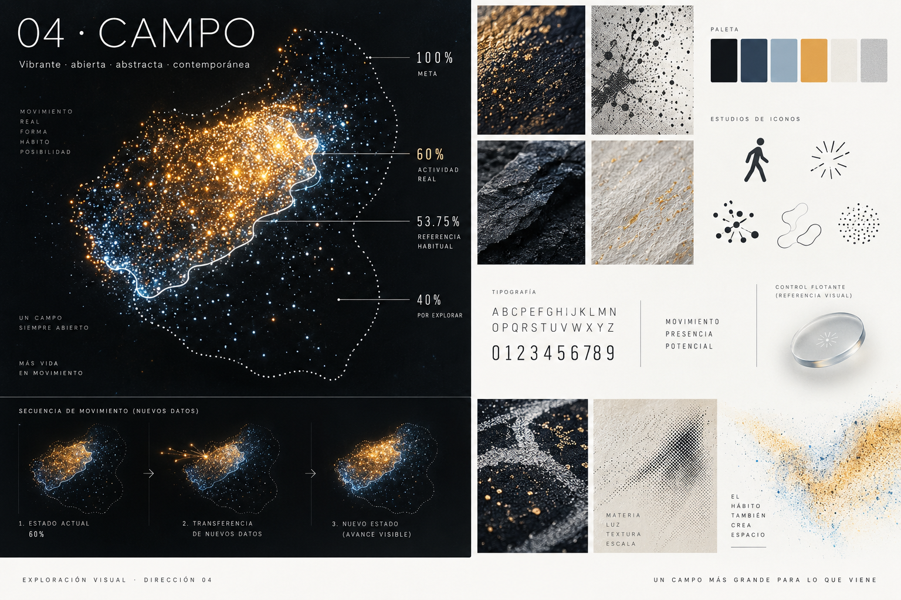

## Doce exploraciones de firma

Cada lámina agrupa tres objetos aislados. No son tres versiones de Home. La siguiente tabla concreta dónde están actual, habitual, final y restante, así como el riesgo de interpretación. El estado en las doce imágenes principales es por delante, con los datos comunes anteriores. Para a tu ritmo/por debajo se conserva el mismo objeto y color y cambia la relación entre sus dos referencias según el estado calculado; la tolerancia y el texto siguen siendo necesarios.

| ID | Firma | Actual ↔ habitual ↔ meta / restante | Riesgo a comprobar |
| --- | --- | --- | --- |
| T01 | Trama abierta | Tejido hasta altura 60 %, costura 53,75 % visible delante, borde final 100 %, hilos abiertos 40 % | Puede parecer tarea incompleta; que la costura no se lea como obligación |
| T02 | Ondas de tejido | Borde tejido 60 %, costura 53,75 %, silueta 100 % sobre eje común; vacío restante | Ondas pueden distorsionar lectura; amplitud es textura, no dato |
| T03 | Costura doble | Dos costuras sobre ala de tejido: actual 60 %, habitual 53,75 %; orillo final 100 % y urdimbre restante | Dos costuras requieren estilos inequívocos y etiquetas |
| P01 | Pliegue testigo | Arista real 60 %, registro impreso 53,75 %, contorno sin imprimir 100 %, hueco 40 % | El pliegue en perspectiva puede aparentar otra proporción |
| P02 | Corte y registro | Corte sólido 60 %, línea de registro 53,75 %, máscara angular 100 %, papel vacío 40 % | Arcos abiertos pueden volver a parecer gauge; candidata de descarte |
| P03 | Tres láminas | Tres hojas alineadas a longitud real/habitual/final; llave actual–meta para restante | Puede parecer gráfico de barras o tres objetivos |
| M01 | Sección viva | Altura formada 60 %, plano testigo 53,75 %, continuación de contorno 100 %, zona sin formar 40 % | Altura debe dominar a volumen aparente; alto coste visual |
| M02 | Relieve compartido | Extensión horizontal del relieve 60 %, grabado 53,75 %, silueta 100 %, espacio sin moldear 40 % | Confundir relieve con montaña/dificultad |
| M03 | Molde y núcleo | Altura del núcleo 60 %, sección habitual 53,75 %, molde 100 %, hueco 40 % | Puede parecer llenado wellness genérico |
| C01 | Campo sembrado | Frente de impresión 60 %, testigo 53,75 %, límite de campo 100 %, región vacía 40 % | Contar puntos o confundir ancho con densidad |
| C02 | Nube y huella | Extremo de nube real 60 %, huella habitual 53,75 %, máscara final 100 %, resto sin nube 40 % | Huella puede perderse y los bordes sugerir incertidumbre |
| C03 | Islas de densidad | Altura ocupada 60 %, testigo horizontal 53,75 %, final 100 %, hueco 40 % | Islas pueden insinuar periodos, mapa o hitos; no tienen ese significado |

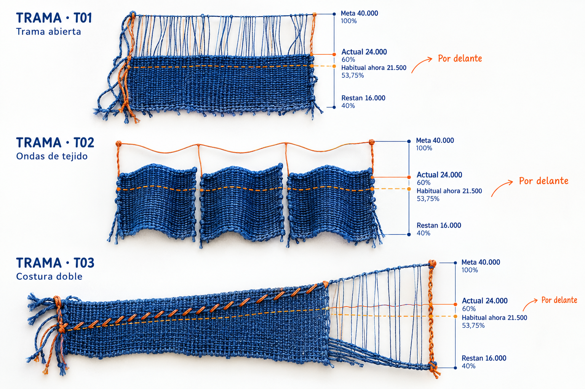

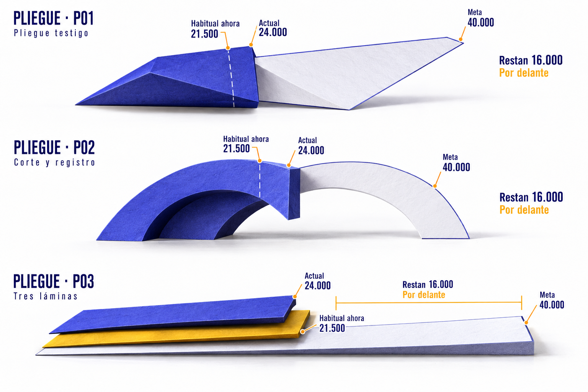

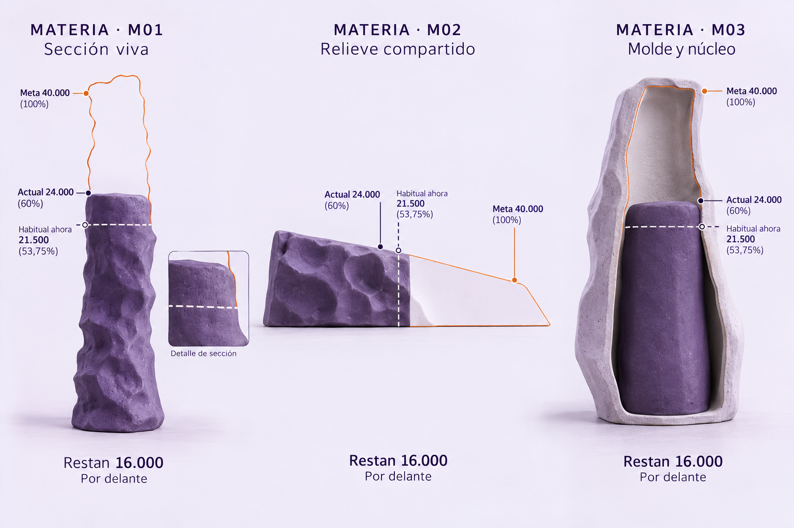

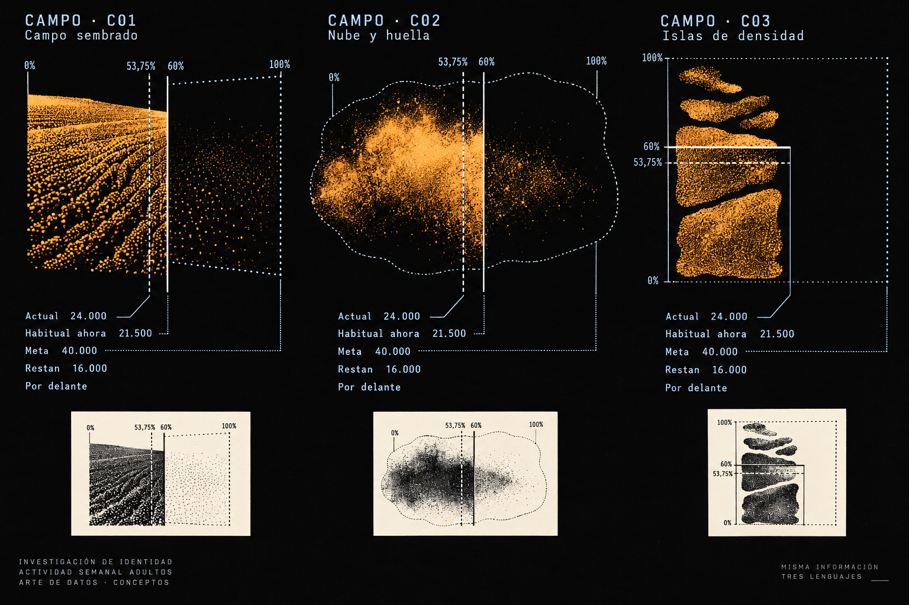

## Tres familias cromáticas

Familias para comparar identidad, sin tokens ni design system. El color identifica métrica y permanece estable entre estados; línea, posición y copy expresan el ritmo. Las muestras de la imagen son conceptuales; los hex siguientes fijan la intención de exploración, sin prometer contraste validado.

| Familia | Pasos | Actividad | Light | Dark | Acento independiente | Afinidad |
| --- | --- | --- | --- | --- | --- | --- |
| F1 · Tinta eléctrica | Ultramar `#304FFE` | Tangerina `#FF8A42` | Blanco frío `#F7F8FC` | Tinta `#12162E` | Lila `#B8AFF2` | Trama; equilibrio humano y contraste material |
| F2 · Pigmento editorial | Violeta `#6A38D5` | Azafrán `#E8AE27` | Blanco `#FCFCFD` | Carbón `#242126` | Azul lavado `#9EB4E8` | Pliegue/Materia; contraste de papel y pliegue |
| F3 · Noche solar | Ámbar `#FFC247` | Hielo `#88CFFF` | Blanco `#F3F5F8` | Negro tinta `#101216` | Ciruela `#BA9EEB` | Campo; luz contenida con lectura de dos identidades |

F1 hace convivir frío y cálido; F2 concentra pigmento en geometría editorial; F3 parte de Dark y utiliza luminancia/impresión. No son tres cambios de saturación de una misma teal/crema. Dark y Light son parejas de atmósfera, no una inversión automática; adaptación final de tonos, contraste y diferenciación sin color quedarían para la Issue posterior.

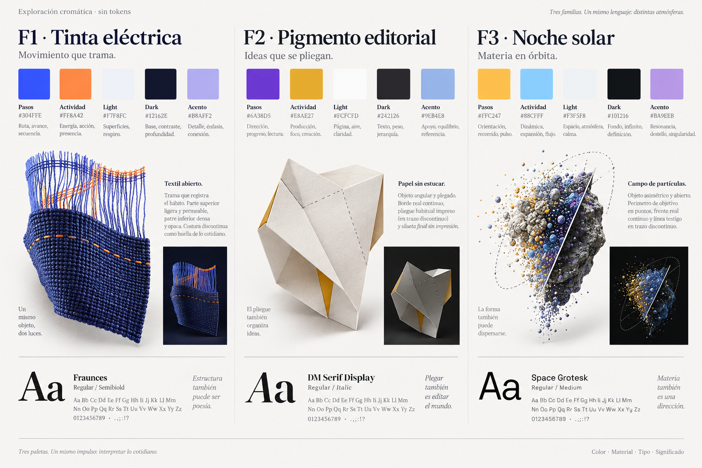

## Materiales y relación con iOS 26

La referencia primaria es [Meet Liquid Glass · WWDC25](https://developer.apple.com/videos/play/wwdc2025/219/), capítulos Principles/Adaptivity: contenido y controles mantienen planos diferentes; los controles se relacionan con su origen y el material se adapta al contexto. Las imágenes siguientes son referencias ópticas, no capturas de una implementación nativa.

| Contenido HealthGoals | Capa de UI nativa | Relación significativa propuesta |
| --- | --- | --- |
| Trama, pliegue, cerámica o campo opacos; testigo habitual y cifras | Navegación y toolbar | El contenido conserva espacio de reposo; al desplazarse bajo controles, separación nativa de borde |
| Objetivo y métrica identificados | Acción contextual de ajustar/retirar | El control nace junto a la métrica concreta, sin botón ambiguo para dos metas |
| Valor y contexto existentes | Confirmar/cancelar o edición nativa contextual | Continuidad entre origen y presentación; no animar el dato como si lo editara el material |
| Forma y cifras estables | Overlay, menú o botones flotantes donde exista necesidad | Elevar temporalmente acciones al interactuar; volver al mismo objeto sin cambiar la identidad del contenido |

Navegación, toolbar, acciones contextuales, edición, overlays y botones flotantes son muestras de material, no una nueva arquitectura de pantallas. No añadir controles solo para exhibir glass. No superponerlo a actual/habitual/meta en reposo. No lensing que desplace marcas cuantitativas. La alternativa con Reducir transparencia es control opaco y legible; Aumentar contraste mantiene separación de líneas/sólidos. No se acredita aquí el comportamiento nativo ni la legibilidad con esos ajustes.

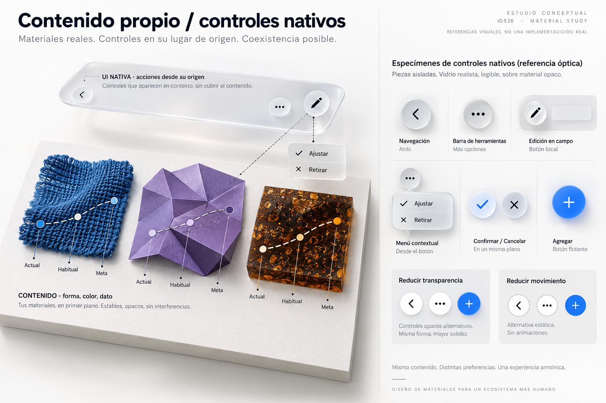

## Motion mediante keyframes

Storyboard conceptual con un objeto aislado como vehículo común; no establece una selección. Secuencias finitas disparadas por datos/acciones reales. Ningún loop, reparto diario, cuenta desde cero, rebote ni demora de interacción. Los tiempos son hipótesis para contrastar después, no configuración aprobada.

| Disparador | Antes → durante → después | Referencias que se conservan | Reduce Motion |
| --- | --- | --- | --- |
| Lectura real nueva | 22.000 → desplazamiento breve del frente → 24.000; restante 18.000 → 16.000 | Habitual 21.500 y meta 40.000 fijos si no cambian; cifras legibles, sin inventar lecturas intermedias | Cambio inmediato a la lectura real, sin desplazamiento ni conteo |
| Actual ↔ habitual | Testigo identificado → separación contextual de dos planos → reposo con actual 24.000 / habitual 21.500 | No cambia el dato por revelar la explicación; no sugerir ritmo en tiempo real | Explicación aparece estática; mismos estilos y posiciones |
| Completar objetivo | 39.500 / 500 restantes → alcanza límite → 40.000 / 0 y «Completado» | Meta 40.000; conservar actual incluso si supera meta; forma puede saturar sin ocultar excedente textual | Estado y gap cambian directamente; sin brillo/barrido celebratorio |
| Añadir/retirar métrica | Un objeto → espacio para segundo → dos independientes; retirada recorre el orden inverso | Primera métrica conserva datos/objetivo/testigo; eliminación activa sigue con confirmación existente | Recomposición inmediata, foco asociado a acción; sin desplazamiento |
| Entrada a edición | Propuesta u objetivo 40.000 junto a su límite → controles desde ese origen → campo editable 40.000 y contexto estable | Acumulado HealthKit 24.000 siempre de solo lectura. Editar borrador sigue inline; edición activa conserva su flujo vigente. Cancelar restaura; no autorizar nueva validación | Cambio inmediato de modo y foco; sin morph ni zoom |

Referencia orientativa de 180–240 ms para cambios geométricos; entrada a edición subordinada a la presentación nativa elegida más adelante. Actualizar también admite correcciones a la baja, sin pérdida de puntos. Un testigo habitual puede cambiar al cambiar el contexto temporal sin que eso signifique actividad nueva. Ausencia de ritmo retira el testigo y muestra «No podemos estimar tu ritmo»; ausencia de progreso no rellena el objeto a cero.

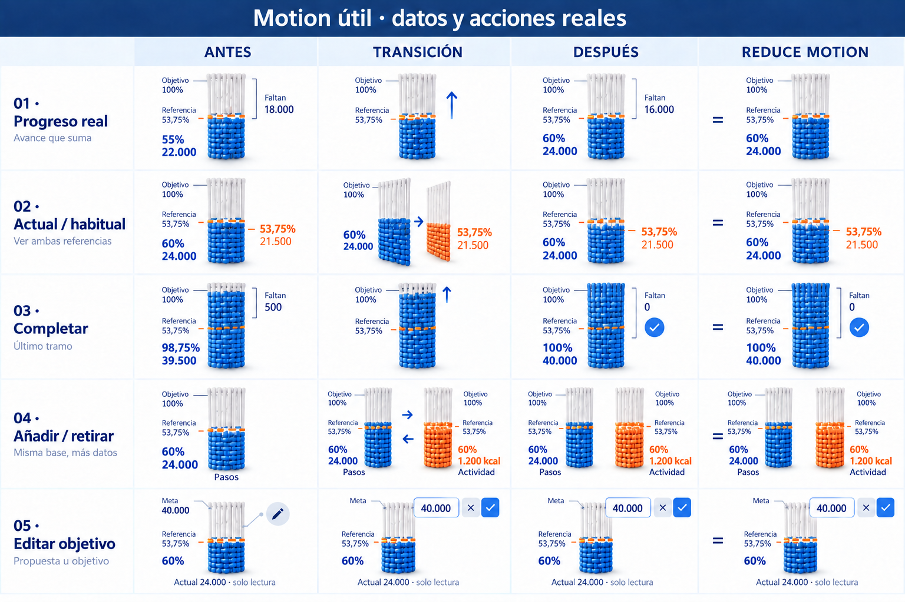

La fila de edición se corrigió tras revisión independiente: el campo corresponde a la propuesta u objetivo **40.000**; el acumulado **24.000** permanece **solo lectura**. El render anterior sugería editar el progreso HealthKit y no debe usarse como referencia. Se conserva el prompt de la edición junto al de generación.

## Test conceptual y candidatas

El test visual complementa las reglas exactas. Una igualdad habitual/actual es un caso claro de a tu ritmo; el estado vigente también incluye tolerancia. El panel de estados mantiene actual/meta/restante de Pasos y mueve únicamente el habitual ficticio a 24.000 o 27.000 para contrastar relaciones. No se mezcla esa variante con los datos comunes de las doce exploraciones. Actividad equivalente usa **1.200 actuales, 1.075 habituales, meta 2.000 y restante 800 kcal activas**: misma geometría normalizada. Diferencia 125 > tolerancia 100, por delante. No se mezclan unidades ni se suman estados de métricas.

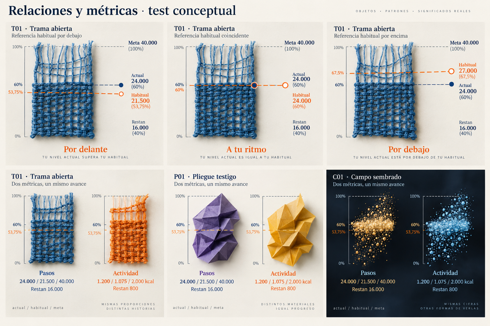

### Recomendación de Design

1. **Trama + T01 Trama abierta + F1 Tinta eléctrica.** Primera candidata: realizado, habitual y restante conviven en un objeto táctil. La costura introduce una segunda referencia sin otro gráfico. La trama abierta aporta reconocimiento y comunica posibilidad de avanzar. El test superior es el más convincente: conserva el actual y mueve el habitual por debajo, a la misma altura y por encima. Riesgo principal: que lo abierto se perciba como deuda o el hilo como cuota. Merece contrastar comprensión antes de invertir en detalle.
2. **Pliegue + P01 Pliegue testigo + F2 Pigmento editorial.** Alternativa de carácter más gráfico y adulto. Una arista real y un registro impreso pueden hacer visible la diferencia sin semáforo moral. Aporta más tensión formal que Trama y menos coste de textura. Su potencial depende de fijar un eje cuantitativo frontal: el origami del test dual muestra carácter y coexistencia, pero su silueta completamente formada todavía no comunica 60 % realizado. La perspectiva no debe gobernar la lectura.
3. **Campo + C01 Campo sembrado + F3 Noche solar.** Candidata experimental con mayor contraste respecto a las otras dos: impresión luminosa, campo abierto y frente de avance. Funciona sin asociarse a caminar y admite identidad distinta por métrica. Es la menos clara para cifras: necesita borde real inequívoco, testigo visible y región restante sin partículas. No recomendaría partículas autónomas ni un recuento literal de puntos.

Son juicios de Design sobre potencial visual, no resultados de pruebas con usuarios ni selección de Product. Materia no entra en las tres primeras: ofrece profundidad atractiva, pero distinguir posición, superficie y volumen añade ambigüedad cuantitativa. P02 se descarta por acercarse al gauge de #40; P03 por parecer tres barras; T02/T03 por el coste de interpretar ondulación o doble costura; M02/M03 y C02/C03 por contorno o escala menos inequívocos. Se conservan como evidencia de divergencia.

### Ocho preguntas por candidata

| Pregunta | Trama · T01 · F1 | Pliegue · P01 · F2 | Campo · C01 · F3 |
| --- | --- | --- | --- |
| ¿Dónde estoy ahora? | Borde del tejido: 24.000 / 60 %. El borde sólido domina a la textura. | Arista realizada: 24.000 / 60 %. Debe leerse sobre un eje frontal, pendiente de depurar. | Frente de impresión: 24.000 / 60 %. El borde necesita más definición que las partículas. |
| ¿Dónde estaría normalmente? | Costura discontinua en primer plano: 21.500 / 53,75 %. Permanece visible al quedar dentro del tejido. | Registro impreso discontinuo: 21.500 / 53,75 %. No es una arista que haya que alcanzar. | Testigo discontinuo: 21.500 / 53,75 %. Debe sobrevivir al campo denso. |
| ¿Dónde termina el objetivo? | Orillo superior del objeto: 40.000 / 100 %, separado de la costura. | Contorno final sin imprimir: 40.000 / 100 %. La lámina no debe parecer ya completada. | Perímetro final del campo: 40.000 / 100 %, estable y visible. |
| ¿Cuánto me queda? | Tramo de urdimbre sin tejer: 16.000 / 40 %, con cifra exacta junto al intervalo actual–meta. | Superficie por realizar hasta el contorno: 16.000 / 40 %, con cifra exacta; no inferir área en perspectiva. | Región vacía hasta el límite: 16.000 / 40 %, con cifra exacta; no contar puntos. |
| ¿Sugiere cuota diaria? | No hay días ni tramos iguales. La costura podría parecer un mínimo: necesita explicación de patrón propio y tono sin deuda. | No hay calendario ni siete pliegues. Evitar llamar al registro «lo que deberías llevar». | No hay agenda ni hitos. Evitar que puntos aislados se lean como obligaciones diarias. |
| ¿Funciona en Actividad/kcal? | Sí como hipótesis: tejido naranja con 1.200 / 1.075 / 2.000, restan 800; no representa un paso ni una distancia. | Sí como hipótesis: papel azafrán con las mismas proporciones y unidades kcal explícitas. | Sí como hipótesis: impresión hielo con las mismas proporciones; sin atribuir energía física a las partículas. |
| ¿Dos veces sin dashboard? | El test muestra dos objetos independientes. Evitar marcos de tarjeta y cuadrícula; falta validar composición real y lectura en tamaño móvil. | Dos piezas con ejes propios pueden convivir; evitar que parezcan widgets o barras apiladas. El test prueba contraste de material, no una Home. | Dos campos independientes con espacio de reposo; riesgo de ruido y mapa de puntos. El test no acredita legibilidad en una pantalla. |
| ¿Reconocible sin logo? | Urdimbre abierta + borde tejido + costura habitual forman una combinación distintiva incluso sin marca. Es la hipótesis más fuerte. | Pliegue + registro testigo aporta carácter; todavía podría confundirse con origami decorativo. | Campo impreso + frente + testigo ofrece una firma potencial; una nube sin esos límites sería genérica. |

### Límites observados en las láminas

La inspección visual encontró errores concretos que no deben trasladarse a Figma: en el moodboard Materia y M02 la disposición aparente del habitual puede quedar después del actual, aunque 21.500 es menor que 24.000; en P03 la hoja habitual parece más larga que la actual. Esas relaciones se descartan. En T01 el líder de «restan» baja hacia el inicio; el intervalo correcto está entre actual y meta. En C01 hay puntos fuera del frente y en el test de Pliegue la pieza parece totalmente formada: ambas requieren reconstruir el borde realizado y el vacío restante. En el storyboard algunas marcas 53,75 % aparecen por encima del frente 60 % y la altura 55 % → 60 % se distingue poco: conservar el disparador y la secuencia, reconstruir las posiciones según el cuadro numérico. La lámina de materiales estudia planos y óptica; la distribución de sus puntos no representa los datos comunes. Los hex y algunas tipografías impresas por el generador son aproximaciones; las familias exactas son las del cuadro escrito. Estos fallos limitan la precisión de las imágenes, pero permiten evaluar el material y la gramática sin presentar una UI aprobada.

### Recomendación conjunta para Product

Tras reunir las dos exploraciones, la terna que mejor combina legibilidad potencial y diversidad es:

| Orden | Combinación inequívoca | Motivo y condición |
| --- | --- | --- |
| 1 | **Principal: Trama + T01 Trama abierta + F1 Tinta eléctrica** | Es la mejor demostración de actual/habitual/restante en una misma materia y cuenta con el test de tres relaciones. Probar que la urdimbre abierta no se lea como deuda. La [Trama testigo D01 del suplemento](suplemento/README.md#tres-combinaciones-recomendadas) aporta una silueta alternativa del mismo territorio, no un cuarto lenguaje. |
| 2 | **Suplemento: Agregar + C02 Mosaico + F3 Baya / Sol** | Frente y soporte estable ofrecen una alternativa a fibras y partículas dispersas. Reconstruir áreas equivalentes, separar habitual del frente y usar un pigmento por métrica. No convertir teselas en cuotas ni anillos. |
| 3 | **Suplemento: Imprimir + B01 Doble impresión + F2 Violeta / Mandarina** | La huella y el registro aportan un lenguaje plano de impresión que contrasta con ambas materias. Unificar escala, reducir grano y agresividad tipográfica; evitar interpretar huellas como pasos literales. |

Las ocho respuestas de T01 están en la matriz anterior; las de C02 y B01 están en la [matriz del suplemento](suplemento/README.md#ocho-preguntas-para-las-candidatas). Ambas forman parte de la entrega de #41. Las ternas de cada exploración permanecen para comparar alternativas, pero esta es la recomendación conjunta de las tres mejores combinaciones. Pliegue/P01 y Campo/C01 quedan como reservas, por ambigüedad de perspectiva o borde. La [candidata 05 · Marcas](#candidata-adicional--05--marcas-tú-y-tu-ritmo) se añade después de esta terna y no la reordena. Product puede seleccionar otras combinaciones del conjunto o ninguna.

## Candidata adicional · 05 · Marcas: Tú y tu ritmo

Propuesta incorporada el 6 de octubre de 2026 a petición de César, elaborada por el agente de este chat tras leer #38, #39, #41 y este dossier. A diferencia de las láminas anteriores, no es una imagen generada: es un render propio en HTML/SVG, con la fuente reproducible en [candidata-05-tu-y-tu-ritmo.html](candidata-05-tu-y-tu-ritmo.html) y dos láminas exportadas con Chrome headless a escala 2x. Las cifras y posiciones del render siguen los datos comunes con exactitud porque se calculan, no se dibujan. Sigue siendo una propuesta conceptual de Fase 1: no es una pantalla terminada, no valida accesibilidad y no autoriza Figma.

**Idea.** Una cinta abierta por métrica y dos marcas sobre ella: un punto de tinta que es «tú» y un anillo del color de la métrica que es «tu ritmo» habitual a estas alturas de la semana. La distancia entre las dos marcas es la firma. La cifra protagonista de cada métrica es el restante, no el porcentaje. Pone la identidad en la relación entre las dos referencias, que es la diferenciación funcional del producto, y no en un material.

### Gramática con los datos comunes

| Referencia | Elemento | Posición con Pasos 24.000 / 21.500 / 40.000 |
| --- | --- | --- |
| Actual | Tramo sólido de la cinta y punto de tinta «tú» | 60 % |
| Habitual ahora | Anillo «tu ritmo», siempre visible delante del sólido | 53,75 % |
| Por delante | Tramo del tono claro de la métrica entre el anillo y el punto, con etiqueta +2.500 | 53,75 % → 60 % |
| Por debajo | Tramo translúcido del mismo tono entre el punto y el anillo, con etiqueta de diferencia | actual → habitual |
| Meta | Marca abierta al final de la cinta, sin contenedor cerrado | 100 % |
| Restante | Tramo discontinuo de bajo contraste hasta la meta; cifra exacta 16.000 | 60 % → 100 % |
| Ritmo desconocido | La cinta no cambia; desaparece el anillo | sin anillo |
| Completado | Cinta cerrada hasta la meta; el excedente se dice con número («41.200 de 40.000») sin agrandar la meta | 100 % |

El estado se deriva con la misma tolerancia que `PaceCalculator`, 5 % de la meta. El tono de cada métrica no cambia con el estado; cambian el orden de las marcas y el tramo entre ellas. No hay rojo ni verde, días, ticks ni siete casillas. Cada métrica lleva su propio titular; no se inventa un estado global.

**Familia cromática.** Reutiliza F1 Tinta eléctrica para que Product compare esta firma con Trama T01 cambiando una sola variable. En Dark los tonos de métrica se aclaran (`#6B86FF`, `#FFA06A`) para mantener contraste sobre tinta; es un ajuste de exploración, no un token.

**Capas iOS 26.** Cinta, marcas y cifras son contenido opaco. Los únicos controles con material son Ajustar junto a cada métrica y Ajustes en la barra. No hay cristal sobre el dato.

**Motion.** Sigue el storyboard anterior: el frente y el punto avanzan 180–240 ms entre dos valores conocidos; el tramo claro aparece cuando «tú» adelanta al anillo; al completar, la cinta se cierra y la cifra pasa a «de 40.000». Con Reduce Motion todo cambia de forma inmediata y el objeto significa lo mismo quieto.

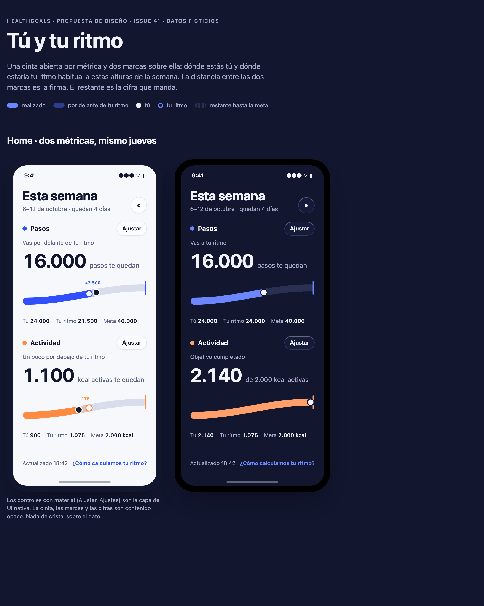

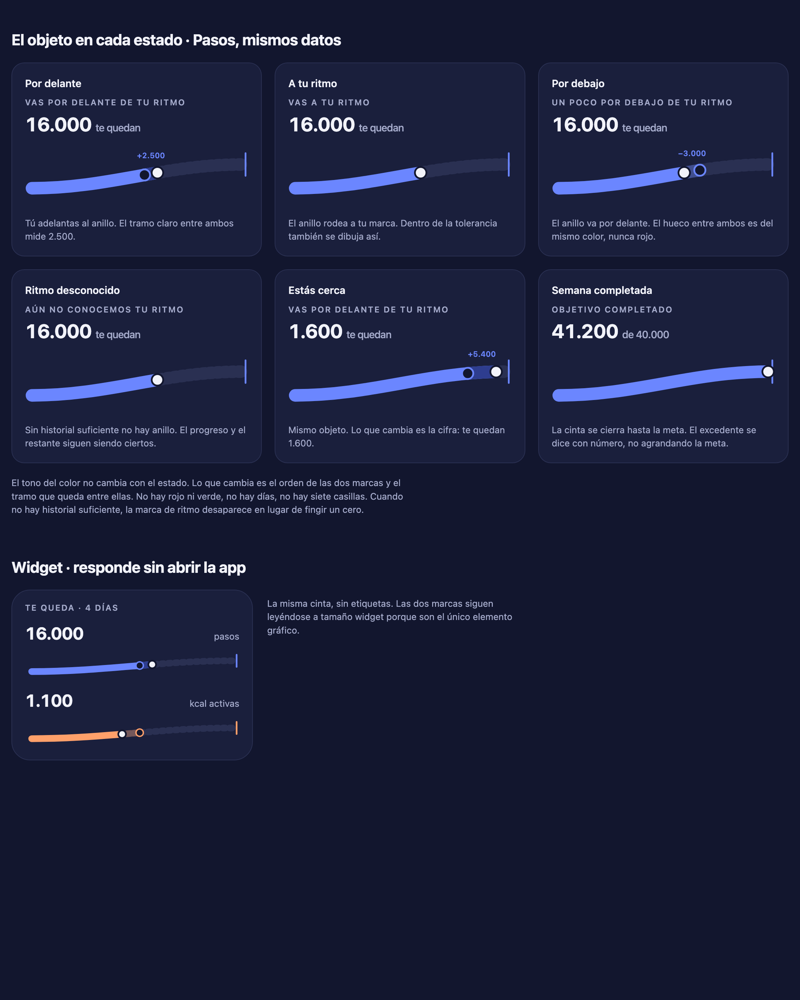

### Ocho preguntas para la candidata 05

| Pregunta | Marcas · Tú y tu ritmo · F1 |
| --- | --- |
| ¿Dónde estoy ahora? | Punto de tinta y fin del tramo sólido: 24.000 / 60 %. |
| ¿Dónde estaría normalmente? | Anillo sobre la misma cinta: 21.500 / 53,75 %. Visible también cuando queda dentro del sólido. |
| ¿Dónde termina el objetivo? | Marca abierta al final de la cinta: 40.000 / 100 %. |
| ¿Cuánto me queda? | Tramo discontinuo y cifra protagonista: 16.000 / 40 %. |
| ¿Sugiere cuota diaria? | No. Sin divisiones ni calendario; el anillo se mueve por el patrón propio. Riesgo: que «tu ritmo» se lea como mínimo exigido; el titular y la explicación secundaria forman parte del diseño. |
| ¿Funciona en Actividad/kcal? | Sí: misma cinta, tono tangerina, unidad explícita. La cinta es abstracta, sin huellas ni caminos. |
| ¿Dos veces sin dashboard? | Sí: dos cintas a toda anchura separadas por aire, sin marcos de tarjeta. El widget muestra la misma cinta sin etiquetas. |
| ¿Reconocible sin logo? | El par punto de tinta + anillo de color sobre una cinta abierta es la firma; ningún competidor dibuja «tu ritmo». |

### Riesgos y límites de la candidata 05

- Que la curva ascendente sugiera dificultad. La cinta puede ser recta sin perder la firma.
- Que a 320 pt el tramo entre marcas sea demasiado fino; la cifra de diferencia haría el trabajo.
- La etiqueta con signo junto al tramo («+2.500», «−175») puede leerse como deuda cuando se va por debajo. Es una decisión de wording pendiente de Product: cifra con signo, frase sin signo o ninguna etiqueta. La fuente deja la función preparada para cambiarla.
- Se parece más a una barra que las materias de las láminas anteriores. La apuesta es que la firma esté en las dos marcas y no en la forma; si Product no la reconoce como propia, la candidata no cumple.
- Render con tipografía del sistema de macOS en Chrome; no acredita SF Pro en iOS, Dynamic Type, VoiceOver, contraste final ni comportamiento nativo del material.

## Evidencia, límites y gate

La entrega conserva copias íntegras de las imágenes finales generadas con la herramienta integrada `image_gen.imagegen` y los prompts completos en [prompts.json](prompts.json), incluida la edición semántica del storyboard. Los originales iniciales y editados permanecen preservados. El inventario [manifest.json](manifest.json) identifica los doce archivos principales, dimensiones y SHA-256; enlaza al [inventario de los once PNG del suplemento](suplemento/manifest.json) y registra bajo `candidata_05` la fuente HTML y las dos láminas renderizadas de la candidata adicional. No contiene credenciales, datos personales ni imágenes tomadas de otras apps.

Se comprueba cobertura de cuatro moodboards, doce conceptos, tres familias, capas, cinco secuencias con Reduce Motion y ocho preguntas por candidata. La comprobación cuantitativa se hace sobre el contrato escrito; no se presenta la perspectiva generada como escala exacta. Checks pertinentes: kit/helper/whitespace y enlaces/archivos del dossier. Swift, build local, simuladores y `make verify` no aplican a un cambio de documentación y artefactos visuales; CI clasificará imágenes/JSON como no exclusivamente Markdown y puede ejecutar el pipeline iOS existente.

Validación local ejecutada en la primera entrega: `make repository-checks` correcto (siete copias del kit, 23 tests del helper/clasificador y whitespace), doce PNG comparados byte a byte con sus originales, JSON parseable, hashes/dimensiones y enlaces locales comprobados. Al integrar el suplemento se verificaron sus dieciséis archivos contra la entrega del otro chat y los once PNG finales contra su manifest; no se descartaron los originales previos. La prueba del transporte del helper necesita un servidor efímero de loopback; se ejecutó con permiso de sandbox para ese check. Repetir todos los checks pertinentes sobre el nuevo SHA combinado y consultar su CI/revisión en la PR.

Para reproducir el inventario desde la raíz del checkout:

```sh
make repository-checks
python3 - <<'PY'
import hashlib, json, pathlib, struct
root = pathlib.Path('docs/design/art-direction-41')
manifest = json.loads((root / 'manifest.json').read_text())
prompts = json.loads((root / 'prompts.json').read_text())
assert len(manifest['imagenes']) == len(prompts['imagenes']) == 12
assert {a['archivo'] for a in manifest['imagenes']} == {a['archivo'] for a in prompts['imagenes']}
for asset in manifest['imagenes']:
    data = (root / asset['archivo']).read_bytes()
    assert data[:8] == b'\x89PNG\r\n\x1a\n'
    assert hashlib.sha256(data).hexdigest() == asset['sha256']
    assert len(data) == asset['bytes']
    assert struct.unpack('>II', data[16:24]) == (asset['ancho'], asset['alto'])
print('12 assets correctos')
PY
```

Pendientes: selección explícita de César/Product (una, dos o ninguna), revisión independiente del SHA y CI del mismo head antes de merge. Pruebas nativas/usuarios, contraste completo, Dynamic Type, VoiceOver, render/materiales/motion en runtime, Light/Dark final y adaptación iPhone/iPad no están ejecutados. No se crearon Figma, SwiftUI, pantallas completas, tokens, widgets, onboarding ni otras superficies.

**Parada requerida por la Issue #41:** César/Product elige 1–2 combinaciones o ninguna. La traducción a Figma requiere una Issue nueva; #30 sigue bloqueada. Abrir la PR o recomendar una combinación no constituye aceptación ni permite cerrar la Issue como aprobada.
