# Dirección artística · exploración complementaria de la Issue #41

Propuesta de Design del chat «Implementar la Issue 41», 6 de octubre de 2026. **Pendiente de selección de César/Product.** Cuatro moodboards, doce firmas aisladas, tres familias cromáticas y referencias de materiales y movimiento. Son estudios generados; no pantallas terminadas ni diseño aprobado. La [Issue #41](https://github.com/montunolabs/HealthGoals/issues/41) requiere detenerse aquí. #30 sigue bloqueada y Figma requiere selección explícita y una Issue nueva.

Esta exploración se preparó en otro chat al mismo tiempo que la entrega principal de la [PR #42](https://github.com/montunolabs/HealthGoals/pull/42). César autorizó coordinar y reunir ambas propuestas en esa PR; se integra como suplemento y conserva la autoría de Design del chat «Implementar la Issue 41». Sus códigos A–D y F1–F3 son **locales a este suplemento**; no sustituyen las familias de la entrega principal. La [recomendación conjunta](../README.md#recomendación-conjunta-para-product) compara ambos conjuntos. La revisión y CI deben corresponder al SHA combinado actual antes de merge.

## Fundamento y alcance

Se consultaron [#38, benchmark Product](https://github.com/montunolabs/HealthGoals/issues/38), [#39, benchmark independiente](https://github.com/montunolabs/HealthGoals/issues/39#issuecomment-6014904321), [el rechazo de #40](https://github.com/montunolabs/HealthGoals/issues/40#issuecomment-6018471087) y [su aclaración](https://github.com/montunolabs/HealthGoals/issues/40#issuecomment-6018671052). De [#32](https://github.com/montunolabs/HealthGoals/issues/32) se conservan las decisiones funcionales válidas: edición inline del borrador, contexto semanal, validación junto al campo, vacío limpio y continuidad al añadir o retirar métricas. No se crean contratos nuevos de validación ni flujos adicionales.

El abanico entendido como gauge, los bloques que parecen un dashboard web y la ilustración separada del dato de #40 no son el punto de partida. Aquí el dato transforma una materia: papel, impresión, agregados o tejido. De Gentler interesa contexto personal; de Waterllama, transformación integrada con dato; de Flighty, respuesta práctica; de Structured, estructura legible; de Things, continuidad. No se copian sus layouts, mascotas, caminos ni calendarios. Fitness sirve como control para evitar anillos, actividad competitiva y deuda diaria.

## Contrato común de lectura

| Métrica ficticia | Actual | Habitual ahora | Meta semanal | Restante |
| --- | ---: | ---: | ---: | ---: |
| Pasos | 24.000 | 21.500 | 40.000 | 16.000 |
| Actividad, kcal activas | 1.200 | 1.075 | 2.000 | 800 |

La proporción equivalente es actual 60 %, habitual 53,75 %, final 100 % y restante 40 %. El ejemplo va por delante. Los porcentajes sirven para comparar propuestas, sin reemplazar cantidades exactas. El estado deberá seguir el cálculo vigente y su tolerancia; las miniaturas «real < habitual / = / >» son simplificaciones conceptuales, no una modificación del algoritmo.

La hipótesis compartida es **materia realizada ↔ testigo habitual ↔ forma final**. El sólido expresa actual, una marca discontinua expresa habitual ahora, el contorno final delimita la meta y la región pendiente expresa restante. El habitual procede del patrón propio en ese momento de la semana, nunca de repartir la meta entre siete días. Un hilo, partícula o tesela no equivale a un día, paso, muestra ni punto ganado.

La escala y el texto generados pueden ser incorrectos. Esta tabla y las reglas escritas rigen sobre los píxeles. A falta de una estimación, no inventar el testigo; a falta de lectura, no convertirla en cero. Las imágenes exploran potencial visual; no acreditan comprensión con usuarios, accesibilidad, contraste, tipografías licenciadas ni implementación nativa.

## Cuatro territorios

### A · Plegar

**Táctil · serena · escultórica · precisa.** Azul cobalto y brasa, sans humanista abierta, geometría de pliegues y cortes, iconos lineales. El papel es ilustración y dato; sombras locales opacas, sin escena lifestyle. La arista realizada podría cambiar ante una lectura real. El contenido de papel convive con controles nativos separados en iOS 26. Riesgo: la perspectiva falsea proporciones y algunos estudios vuelven al abanico de #40. Su vocabulario puede aportar material, pero no recomiendo ese abanico como firma.

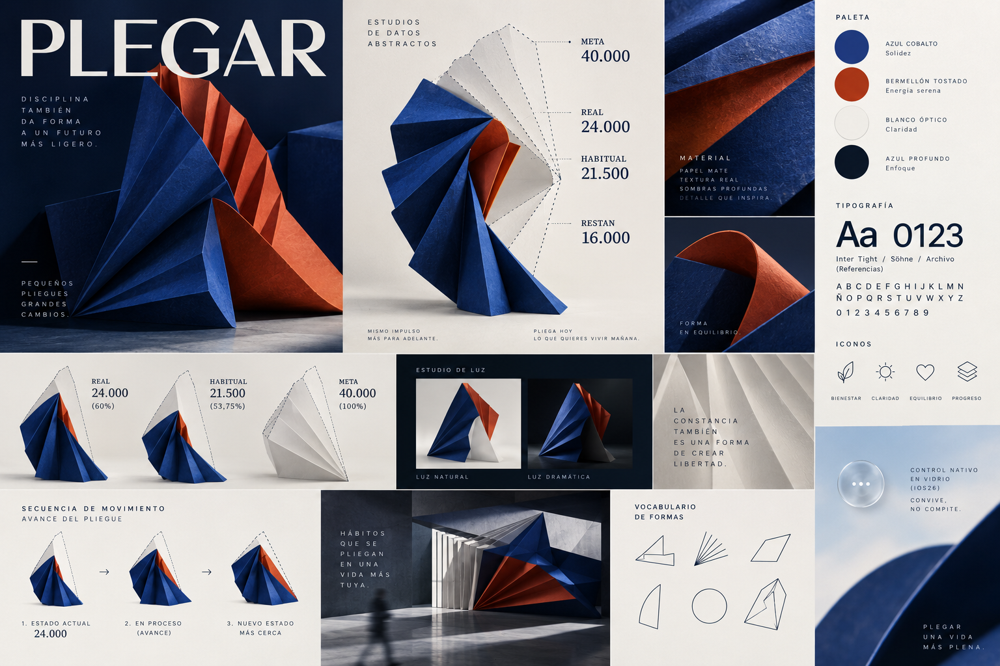

### B · Imprimir

**Gráfica · directa · expresiva · urbana.** Mandarina y ultravioleta, sans condensada, grano de impresión y marcas de registro. Iconos secos y monolineales; sin personaje ni ilustración figurativa. Dos impresiones de una misma forma exploran actual e histórico, dentro de un límite semanal. Profundidad casi plana y movimiento de registro breve ante datos reales. Su energía contrasta con la ligereza de los controles nativos. Riesgo: titulares gigantes y slogans generados pueden sentirse agresivos; no forman parte de la voz aprobada.

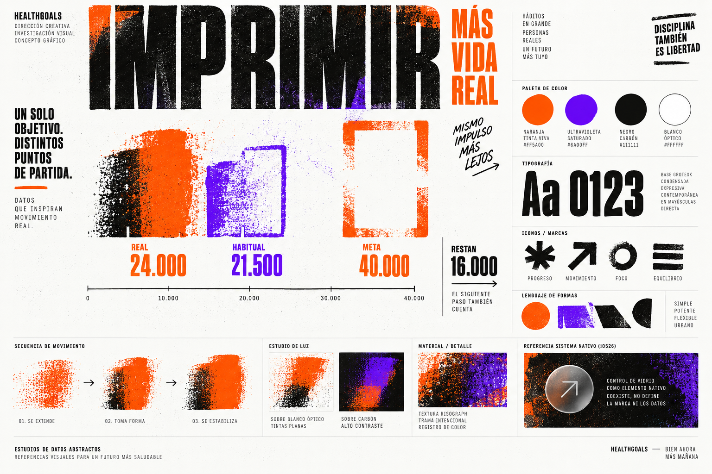

### C · Agregar

**Atmosférica · luminosa · espacial · curiosa.** Baya y amarillo solar, serif editorial y numerales claros, pigmentos, cerámica y partículas irregulares. Iconografía fina; ilustración abstracta hecha con materia acumulada. Profundidad de relieve y sombras mates. El movimiento reúne materia exclusivamente al cambiar la lectura; no polvo flotando en reposo. Sobre iOS 26, controles separados del contenido opaco. Riesgo: confundir masa, área y volumen; no adoptar el aspecto de meditación ni una promesa de bienestar.

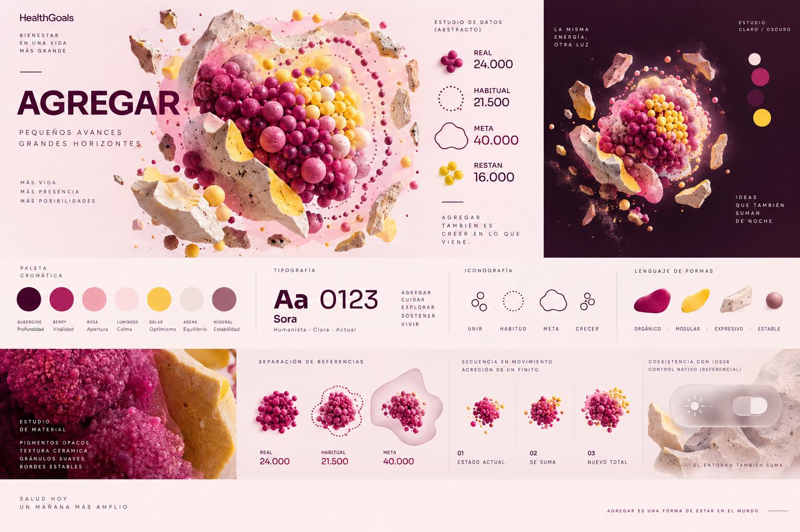

### D · Entrelazar

**Cálida · artesanal · adulta · rítmica.** Azul aciano y azafrán, serif sobria con cifras utilitarias, urdimbre, costuras y bordes irregulares. Iconos de trazo sencillo, sin mascota. Lo tejido y lo abierto son dato e ilustración. Profundidad local de fibra; una lectura nueva convierte un tramo en tejido y después descansa. Los controles nativos conservan su propio plano. Riesgo: el hilo habitual puede confundirse con obligación y la textura perderse en tamaño móvil.

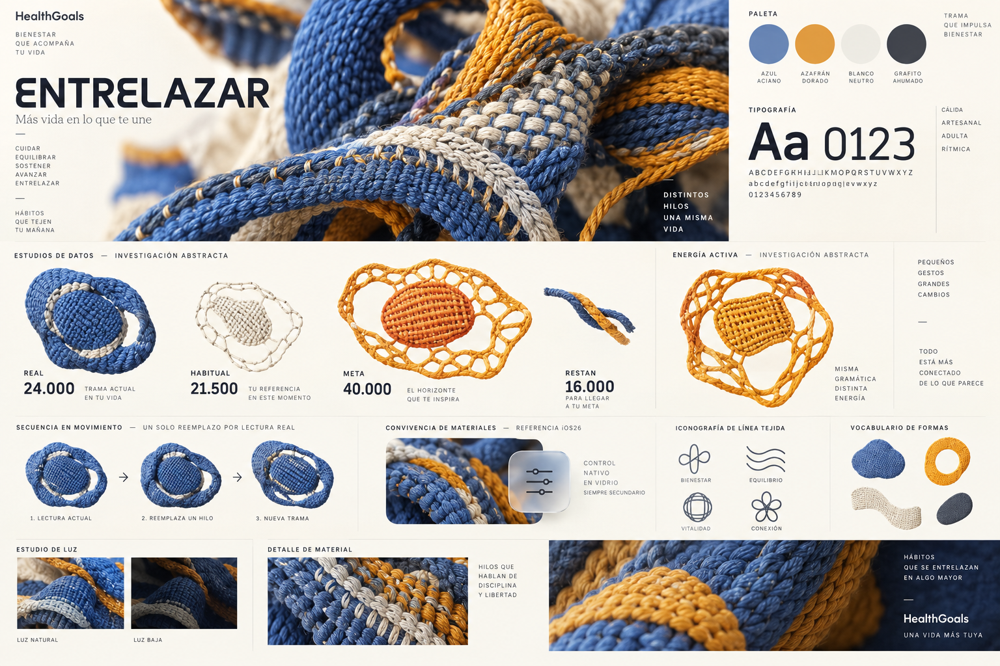

## Doce firmas rápidas

Cada lámina contiene tres estudios principales y pequeñas variantes. Los identificadores impresos se repiten como «A01–A03» por un error del generador. **Los códigos canónicos siguientes usan territorio y posición izquierda–centro–derecha.** Las etiquetas de valores son comunes; la geometría generada no se afirma calibrada.

| Código | Nombre | Actual ↔ habitual ↔ final y restante | Evaluación de Design |
| --- | --- | --- | --- |
| A01 | Pliegue testigo | Papel sólido / registro discontinuo / plantilla abierta; papel por formar | Perspectiva invierte la lectura del registro en partes: potencial material, no candidata principal |
| A02 | Estratos | Hoja realizada / capa testigo / envolvente final; hueco restante | Capas pueden parecer cantidades que se suman o varias metas |
| A03 | Ventana | Apertura realizada / marca habitual / corte final; zona pendiente | Se aproxima a gauge; descarte para shortlist |
| B01 | Doble impresión | Huella sólida / huella habitual discontinua / contorno final; margen sin imprimir | Candidata: dos referencias en una forma, necesita escala común y menor grano |
| B02 | Corte tipográfico | Corte sólido / trazo habitual / silueta de destino; área abierta | La forma parece un «2» sin significado y puede convertirse en gauge |
| B03 | Calco | Pigmento real / registro / hoja final; región sin pigmento | Superponer colores sugiere dos métricas sumadas; descarte |
| C01 | Archipiélago | Agregado lleno / traza habitual / máscara final; agregado vacío | Partículas de tamaños distintos y contorno poco firme dificultan cantidad |
| C02 | Mosaico | Teselas pigmentadas / costura habitual / soporte final; teselas vacías | Candidata: superficie tangible; áreas y orden de llenado necesitan reconstrucción |
| C03 | Duna | Masa formada / estrato habitual / volumen final abierto; materia pendiente | Relieve atractivo pero volumen ilegible; descarte |
| D01 | Trama testigo | Fibra tejida / costura habitual / orillo final; urdimbre abierta | Primera candidata: reconoce lo realizado y lo disponible en una misma materia |
| D02 | Dos hilos | Tejido / hilo testigo / vuelta final; parte abierta | La torsión forma un anillo y aparenta mezcla de objetivos; descarte |
| D03 | Urdimbre | Hilos densos / costura habitual / silueta final; fibras abiertas | La densidad y profundidad ocultan el frente; conservar como material secundario |

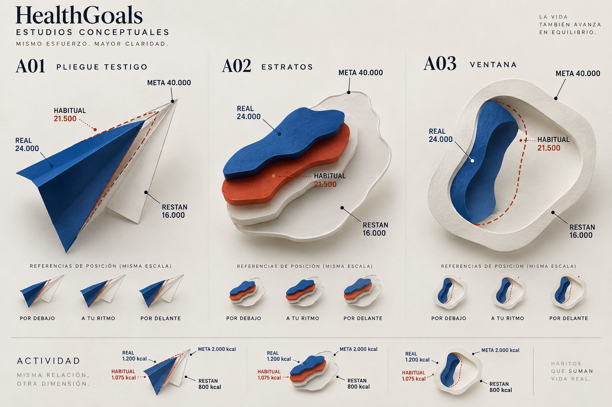

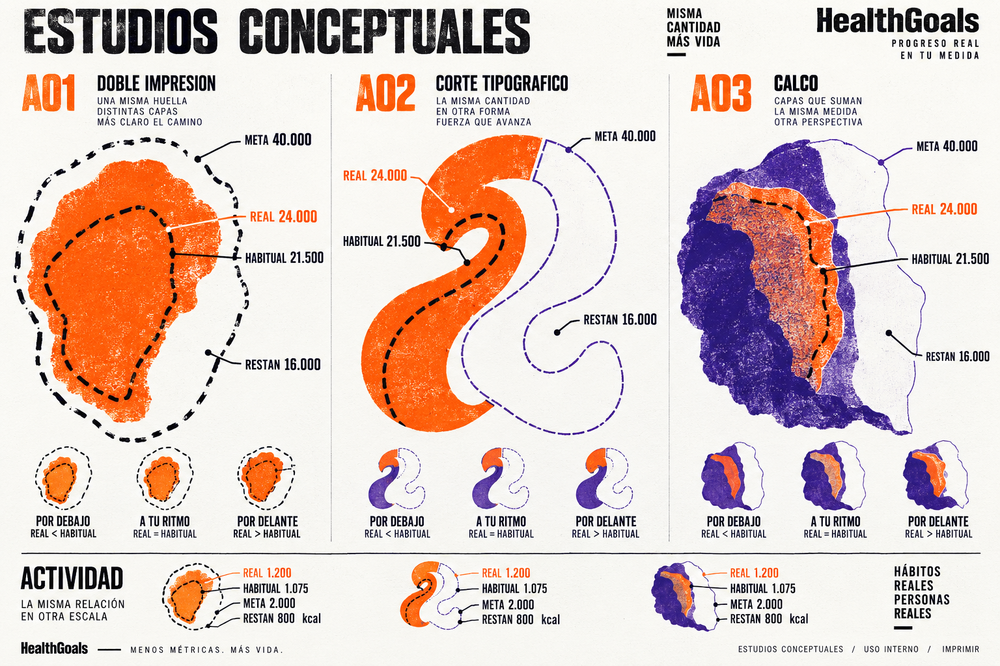

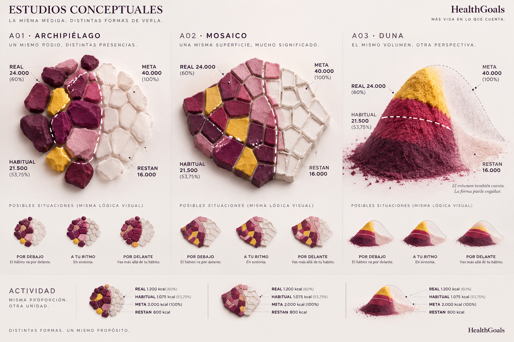

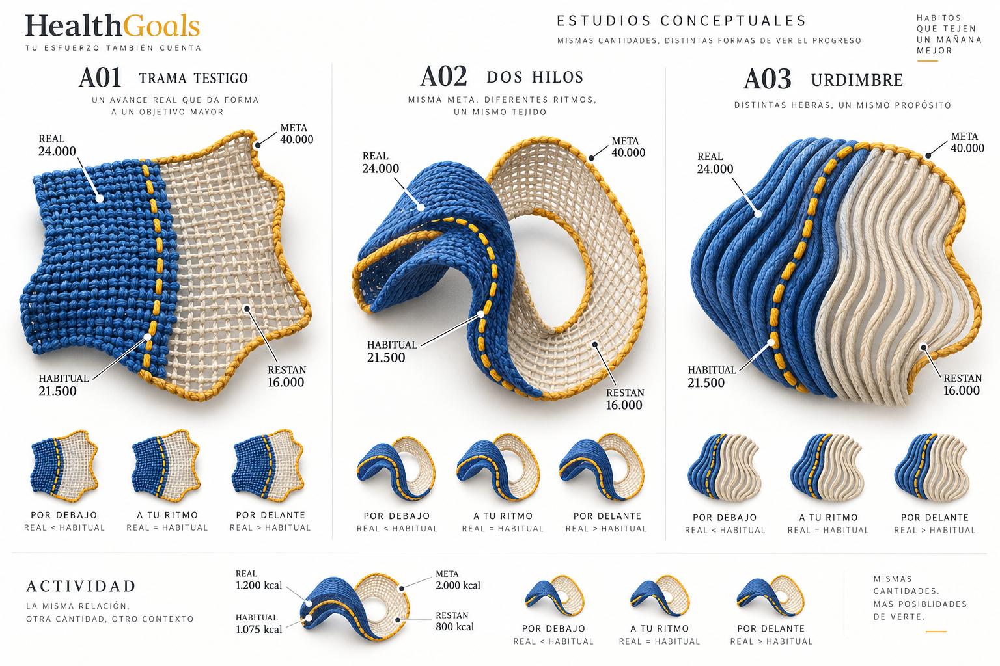

Las miniaturas de estados exploran la posición relativa del testigo, pero varias son casi idénticas y no resuelven la diferencia. La construcción posterior debe poder mantener actual/meta/restante fijos y mover habitual: 21.500 por delante, 24.000 a tu ritmo, 27.000 por debajo en este ejemplo. Esa variación no representa tres lecturas nuevas. Las variantes kcal de B/C muestran portabilidad de la metáfora; la lámina D usa D02 para kcal y no valida todavía D01 en esa unidad.

## Tres familias cromáticas

Son combinaciones de pigmento para explorar, no tokens. Identidad de métrica estable entre estados; la relación geométrica y el texto expresan el ritmo. Ningún rojo/verde de premio o castigo. La teal/crema está descartada. Las superficies claras cálidas de algunos moodboards estudian papel, no reintroducen esa familia.

| Familia del suplemento | Pasos | Actividad | Light | Dark | Acento |
| --- | --- | --- | --- | --- | --- |
| F1 · Cobalto / Brasa | `#2954D1` | `#D45A32` | `#F7F8FC` | `#131A2B` | `#94A9FE` |
| F2 · Violeta / Mandarina | `#7954E8` | `#EE6A18` | `#FFFFFF` | `#201D25` | `#C9C1FF` |
| F3 · Baya / Sol | `#B22F68` | `#E5AD1A` | `#FFF5FA` | `#281522` | `#F2A3C6` |

F1 enfrenta mineral frío y pigmento cálido; F2 propone impacto gráfico con blanco/carbón; F3 propone materia rosada con fondo berenjena. Son tres atmósferas y parejas de métricas, sin cambiar colores al completar una meta. Contraste, variaciones accesibles y adaptación final Light/Dark siguen pendientes. Las miniaturas inferiores de F2/F3 cambian pigmento pese al prompt: **no adoptarlas como codificación de estado**; rigen los roles del cuadro.

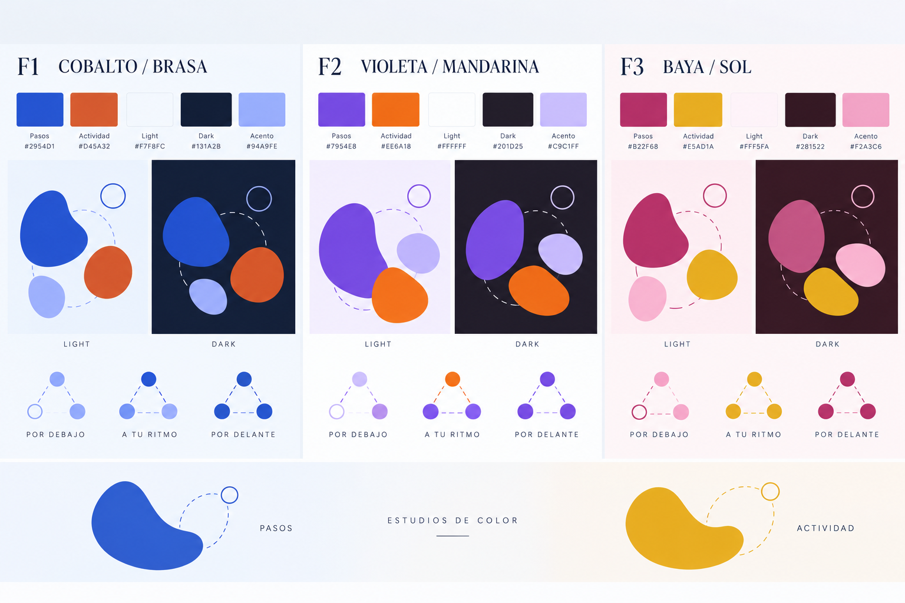

## Contenido y materiales nativos

Apple presenta Liquid Glass como una capa funcional de controles y navegación separada del contenido: [Meet Liquid Glass, WWDC25](https://developer.apple.com/videos/play/wwdc2025/219/), capítulos Adaptivity y Principles. La interpretación para HealthGoals es conservar su materia opaca y sus marcas cuantitativas, usando la UI nativa para las acciones. Esta lámina es una referencia óptica generada, no una captura ni prueba de APIs.

| Contenido propio | Referencia nativa | Relación propuesta |
| --- | --- | --- |
| Firma, color, ilustración, marcas y cifras | Navegación y toolbar | Plano superior con separación legible; preservar espacio para datos |
| Métrica concreta y su objetivo | Acciones contextuales | Vincular el control a su origen; evitar acciones ambiguas con dos métricas |
| Propuesta u objetivo editable 40.000 y contexto | Edición, campo, cancelar/confirmar | Acumulado 24.000 de solo lectura; conservar edición inline de borrador y flujo activo vigente de #32 |
| Objeto opaco en reposo | Overlay y botón flotante de añadir | Material transitorio cuando haya una acción, sin cristalizar toda la firma |

No aplicar refracción a las marcas del actual o habitual. El overlay esquemático no propone trasladar el borrador a un modal. Reducir transparencia tendría controles opacos; el contenido conserva sus estilos de línea y etiquetas. No se ha probado el ajuste nativo ni Aumentar contraste.

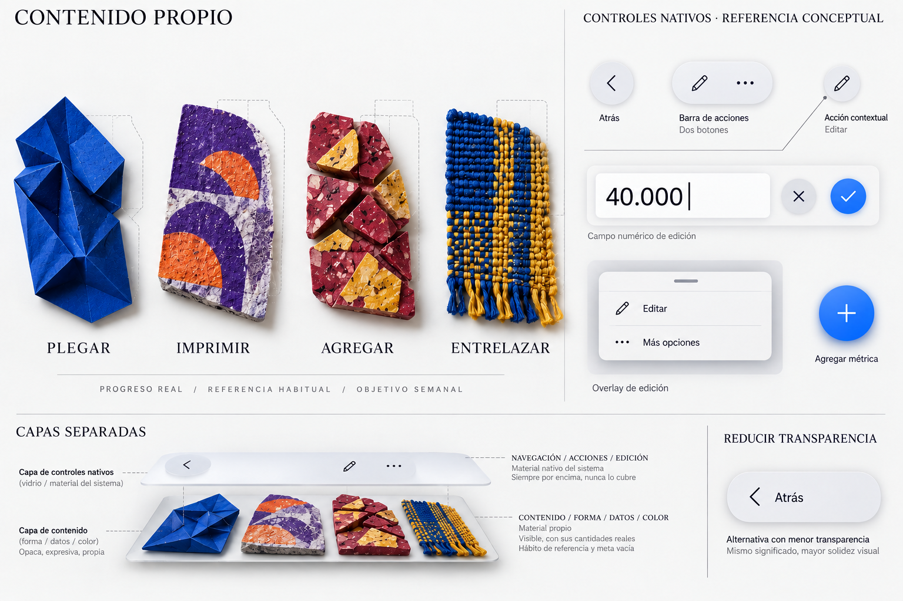

## Motion con causa y alternativa estática

Seis filas de keyframes con objetos aislados. El tejido sirve como vehículo de la explicación y no constituye selección. Los marcos rectangulares pertenecen a la lámina; no proponen barras ni tarjetas para una Home. Sin loops, respiración decorativa, cuenta inicial desde cero, rebote ni demora de interacción.

| Evento | Antes → transición → después | Referencias estables | Reduce Motion |
| --- | --- | --- | --- |
| Actualizar lectura real | 22.000 / restan 18.000 → frente interpola → 24.000 / restan 16.000 | Habitual 21.500 y meta 40.000 si no cambian | Sustituir directamente por la nueva lectura |
| Relación actual ↔ habitual | Testigo visible → énfasis breve → misma relación 24.000 / 21.500 | Ninguna cantidad cambia por explicar el dato | Énfasis estático mediante estilo o texto |
| Completar meta | 39.600 / restan 400 → cruza 40.000 → real 40.600 / restan 0 | Conservar excedente exacto; forma puede saturar | Cambio directo del estado y restante |
| Añadir / retirar | Un objeto → reacomodo → dos independientes; retirar recorre orden inverso | Datos de la primera métrica y confirmación vigente | Recomposición y foco inmediatos |
| Entrar a edición | Propuesta u objetivo 40.000 → controles desde su origen → campo 40.000 y contexto estable | Acumulado 24.000 de solo lectura. No aplicar borrador antes de confirmar; cancelar restaura | Cambio inmediato de modo y foco |
| Reduce Motion | Lectura inicial → reemplazo inmediato → lectura final | Igual información, sin ruta ni interpolación | Es la secuencia estática común |

Hipótesis de movimiento finito: aproximadamente 180–240 ms para un frente o reacomodo, subordinado a interacción y pruebas posteriores. No se fijan duraciones finales. Los valores intermedios dibujados, como 40.100, son interpolación visual, no datos recibidos; las cifras del producto deben mostrar lecturas reales. Al superar meta, restante es cero. Una corrección a la baja puede deshacer tejido sin castigo. Un habitual que cambie por contexto temporal no significa actividad nueva.

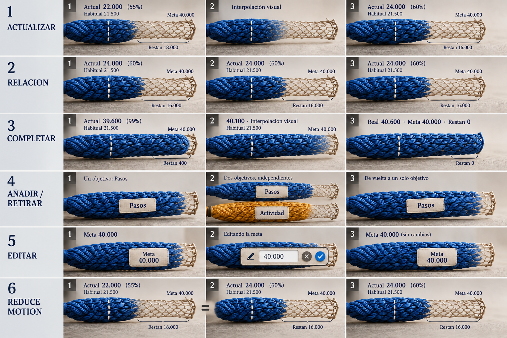

## Tres combinaciones recomendadas

1. **D · Entrelazar + D01 Trama testigo + F1 Cobalto / Brasa.** Mejor potencial de firma: borde tejido, costura habitual y urdimbre disponible conviven en un objeto propio. La paleta F1 conservaría dos identidades de métrica; la lámina D ensaya azul/azafrán y no representa todavía esta sustitución exacta. Hay que separar la costura del frente y evitar que lo abierto parezca deuda.
2. **C · Agregar + C02 Mosaico + F3 Baya / Sol.** Alternativa de materia granular, con más contraste respecto al textil. Ofrece un soporte estable y pigmentación ligada al dato. Hay que fijar área equivalente, orden de ocupación, frente y referencia, y retirar el amarillo como segunda cantidad dentro de una misma métrica.
3. **B · Imprimir + B01 Doble impresión + F2 Violeta / Mandarina.** Alternativa gráfica y plana: la huella habitual queda en la misma forma, sin otro gráfico. Hay que reducir agresividad tipográfica, unificar escalas de las tres siluetas y reservar un pigmento por métrica. La lámina B usa mandarina; la combinación para Pasos usaría violeta conforme a F2.

Las combinaciones son propuestas de Design, no resultados de investigación ni selección de Product. Plegar no entra en las primeras tres por la ambigüedad de perspectiva y la cercanía de algunas piezas al gauge ya rechazado. D02 se descarta por anillo y C03 por volumen difícil de cuantificar.

### Ocho preguntas para las candidatas

| Pregunta | D01 · Trama testigo | C02 · Mosaico | B01 · Doble impresión |
| --- | --- | --- | --- |
| ¿Dónde estoy ahora? | Extremo tejido, 24.000. Borde y costura aparecen demasiado juntos: necesitan separación. | Frente de pigmentación, 24.000. La tesela parcial y el área aún no están calibradas. | Borde de huella sólida, 24.000. Aún necesita una escala común, no tamaño ornamental. |
| ¿Dónde estaría normalmente? | Costura discontinua, 21.500, superpuesta al tejido y visible. | Marca discontinua, 21.500, que atraviesa el soporte y no lo divide en días. | Huella discontinua, 21.500, dentro de la real en este ejemplo. |
| ¿Dónde termina el objetivo? | Orillo final, 40.000; distinto del hilo habitual. | Límite del soporte, 40.000; permanece mientras cambia la ocupación. | Contorno externo, 40.000; no representa otra métrica. |
| ¿Cuánto me queda? | Urdimbre abierta, 16.000. La región tiene que leerse con cifra exacta. | Región sin pigmento, 16.000. No contar teselas de tamaño desigual. | Margen entre real y límite, 16.000. La imagen no demuestra un área de 40 %. |
| ¿Sugiere cuota diaria? | No hay siete tramos, pero la costura puede parecer un mínimo exigido. Explicar hábito personal sin «deberías». | No hay calendario; evitar siete piezas, casillas por día o hitos obligatorios. | No hay calendario; el registro habitual debe conservar lenguaje descriptivo. |
| ¿Funciona en kcal? | Hipótesis transferible: mismo objeto con 1.200 / 1.075 / 2.000 y restan 800. Falta lámina kcal de D01; D02 no la valida. | La variante kcal usa la misma materia y proporción; ni piedra ni color representan caminar. | La variante kcal mantiene huella y registro; cantidades exactas, sin sumar métricas. |
| ¿Puede repetirse dos veces sin dashboard? | Dos textiles independientes pueden convivir sin marcos; materiales muestra pares esquemáticos. No está probada una composición móvil. | Dos soportes sin cuadrícula son posibles; granulado puede generar ruido y parecer tarjetas. | Dos huellas con aire y menor título podrían convivir; riesgo de póster denso. No se acredita una Home. |
| ¿Reconocible sin logo? | Urdimbre abierta y costura testigo ofrecen la hipótesis más singular. | Teselas vacías/pigmentadas y costura tienen potencial, pero un círculo genérico perdería identidad. | Registro sobreimpreso tiene carácter propio; el grano por sí solo sería decoración genérica. |

## Inspección visual, trazabilidad y límites

Se inspeccionaron las once salidas finales. La generación inicial de paletas introdujo personas y escenas; materiales introdujo métricas ajenas; motion mostró restante positivo tras superar la meta. Se editaron esas tres láminas con la herramienta integrada antes de incluirlas. Los PNG finales son copias íntegramente generadas, sin montaje ni corrección de píxeles externa.

Persisten límites concretos: códigos A repetidos en las láminas B–D; slogans y tipografías inventados que no aprueban voz ni marca; perspectiva de A; teselas desiguales y amarillo ambiguo de C; habitual pegado al actual en D; variaciones de estado casi iguales; colores de miniaturas de F2/F3 inconsistentes. Los textos «a tu ritmo» de las imágenes omiten tolerancia. No trasladar esos detalles a diseño final. El storyboard conserva algunas proporciones aproximadas: su evidencia es el evento y los keyframes, no la distancia cuantitativa ni un timing validado.

Los prompts exactos en inglés se conservan como registro de entrada de generación, no como documentación de producto: [generación](generation-prompts.json), [apoyos](support-prompts.json), [ediciones](refinement-prompts.json). Las rutas `source` de las ediciones identifican la primera salida de cada lámina; los PNG entregados contienen la segunda versión. El [manifest.json](manifest.json) registra los once PNG finales, bytes, dimensiones y SHA-256. Son datos ficticios; no contienen credenciales ni datos personales de salud.

## Validación reproducible y cobertura

Comprobaciones de este suplemento: JSON parseable, once PNG, dimensiones y hashes, enlaces locales y cobertura del dossier. Kit/helper/whitespace, revisión independiente y CI deben repetirse **después de su integración en un nuevo SHA de la PR #42**. No se afirma haber ejecutado ese gate sobre archivos todavía sin integrar. Swift, build y simuladores locales no aplican al suplemento documental; la CI existente puede ejecutar iOS por PNG/JSON.

Desde la carpeta del suplemento:

```sh
python3 - <<'PY'
import hashlib, json, pathlib, struct
root = pathlib.Path('.')
manifest = json.loads((root / 'manifest.json').read_text())
assert len(manifest['imagenes']) == 11
for asset in manifest['imagenes']:
    data = (root / asset['archivo']).read_bytes()
    assert data[:8] == b'\x89PNG\r\n\x1a\n'
    assert hashlib.sha256(data).hexdigest() == asset['sha256']
    assert len(data) == asset['bytes']
    assert struct.unpack('>II', data[16:24]) == (asset['ancho'], asset['alto'])
print('11 PNG íntegros')
PY
```

| Criterio de #41 | Evidencia en este suplemento |
| --- | --- |
| Cuatro moodboards distintos y 3–5 adjetivos | A Plegar, B Imprimir, C Agregar, D Entrelazar y sus cuatro imágenes |
| Doce conceptos con actual/habitual/meta/restante | Catálogo A01–D03 y cuatro trípticos, fixtures comunes |
| Tres familias con métricas, Light/Dark y acento | F1–F3, tabla exacta y lámina cromática |
| Contenido frente a Liquid Glass | Tabla de planos, controles de referencia y lámina corregida |
| Movimiento causado por datos/acciones y Reduce Motion | Cinco eventos más fila estática, tabla y storyboard corregido |
| Tres mejores combinaciones y ocho preguntas por candidata | Ranking D01/F1, C02/F3, B01/F2 y matriz conceptual |
| Entrega en Issue y parada para selección | Suplemento integrado en PR42, con láminas para publicar en #41; selección de César/Product pendiente |

**Parada de Product:** elegir una, dos o ninguna combinación después de revisar el material. No hay aceptación automática, cierre de #41, desbloqueo de #30 ni autorización para avanzar a Figma. Pruebas con usuarios, lectura a tamaño móvil, accesibilidad, cantidades calibradas, Light/Dark final y materiales/motion en runtime requieren el trabajo posterior autorizado.
